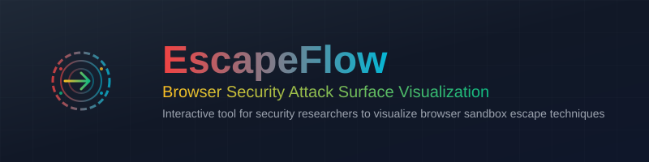

<div align="center">
  
</div>


**This web application was created as part of my Bachelor thesis about browser sandbox escapes. It is an interactive web application designed for security researchers that visualizes attack surfaces and privilege escalation paths in modern browsers. This tool demonstrates various exploitation techniques across different privilege levels, from browser engine sandbox escapes to kernel-level privilege escalation.**

Currently focused on Chromium with a database of 6,000+ CVEs, with plans to expand to multi-platform browser security research.

## Features

### Attack Flow Visualization
- **Interactive Flow Diagrams**: Visualize attack surfaces with draggable React Flow components
- **Multi-Level Privilege Escalation**: Simulate attacks across V8 Heap Sandbox, Renderer Process, GPU Process, Browser Process, and System/Root levels
- **Attack Chain Tracking**: Complete visual representation of successful attack paths with sliding panel
- **Tree View**: Comprehensive tree visualization modal showing all attack progression paths
- **Platform Selection**: Choose between different OS (Android, iOS, Windows, macOS, Linux) and browser combinations
- **Multiple Export Formats**: Export attack chains as PNG, JSON, PlantUML, and Mermaid diagrams

### CVE Database & Catalog
- **Comprehensive CVE Database**: Browse and manage 6,000+ Chromium and Android CVEs with PostgreSQL backend
- **Advanced Filtering**: Filter by severity, OS, target components, date ranges, and search by CVE ID
- **CVSS Scoring**: Detailed CVSS v3.x metrics and severity ratings with visual indicators
- **CVE Management**: Create, edit, delete, and bulk operations on CVE entries
- **Proof-of-Concept Tracking**: Store and manage POCs with code snippets, URLs, and references
- **Attack Vector Mapping**: Link CVEs to exploitation techniques and target components
- **External Data Integration**: Fetch and import CVE data from NVD and other external sources

### Architecture & Design
- **Database-Driven**: PostgreSQL with Prisma ORM for scalable data management
- **Responsive Design**: Adaptive layout with collapsible panels and detailed information views
- **Global State Management**: React Context API for attack simulation state
- **RESTful API**: Full API layer for CVE, attack techniques, and component management

## Getting Started

### Prerequisites

- [Bun](https://bun.sh/) (v1.x or later)
- Docker and Docker Compose (Podman should work as well)

### Local Development

1. **Clone the repository:**
   ```bash
   git clone https://github.com/filiprab/escapeflow.git
   cd escapeflow
   ```

2. **Copy environment template:**
   ```bash
   cp .env.example .env
   ```

3. **Update environment variables:**
   ```
   # Database credentials
   POSTGRES_PASSWORD=your_secure_password
   ``` 
   ```
   # Optional: NVD API key for higher rate-limits during bulk CVE imports
   NVD_API_KEY=your_nvd_api_key
   ```

## Docker Deployment

### Build and Run with Docker

1. **Build and run the Docker image:**
   ```bash
   docker compose up -d --build
   ```
   The first run may take a minute or two while it builds the image, runs database migrations, and seeds the CVE data.

2. **Access the application:**
   Open [http://localhost:3000](http://localhost:3000)

## Usage Guide

### 1. **Starting an Attack Simulation**
- Select your target platform (OS and browser) from the header dropdowns
- Begin at the "V8 Heap Sandbox" privilege level
- Select an available attack vector from the interactive flow diagram
- Review detailed attack information in the right panel including CVEs, POCs, impact analysis, and mitigations

### 2. **Privilege Escalation**
- Click "Execute Attack" to select your attack technique
- Choose "Escalate Privilege" to advance to the next privilege level
- Each escalation automatically adds to your attack chain in the left panel
- Continue the progression until reaching System/Root access

### 3. **Viewing Attack Chains**
- The attack chain panel on the left automatically tracks your progression
- Toggle the panel visibility using the arrow button
- Click "Show Tree" in the header to view a comprehensive tree visualization
- Export your chain in multiple formats: PNG image, JSON data, PlantUML diagram, or Mermaid diagram

### 4. **Navigation and Controls**
- Use "Reset Simulation" in the header to start over
- Toggle between different privilege levels and attack vectors
- Try different platform combinations to explore various attack scenarios
- Use the tree view to understand the complete attack surface landscape

## Architecture

### Component Structure
- **Next.js 15 App Router**: Server-side layout with client-side interactivity
- **React Context API**: Global state management for attack simulation
- **React Flow**: Interactive flow diagrams for attack surface visualization
- **Tailwind CSS**: Responsive styling with dark theme
- **TypeScript**: Type-safe development

### Key Components
- **Header**: Platform selection and simulation controls
- **AttackSurfaceFlow**: Main interactive flow visualization
- **AttackDetails**: Detailed attack information panel
- **AttackChainPanel**: Sliding panel showing attack progression
- **TreeView**: Comprehensive modal for attack tree visualization

## Security Education

This tool is designed for educational purposes to understand:

- **Browser Security Models**: How modern browsers implement security boundaries
- **Sandbox Escapes**: Common techniques used to escape sandboxed environments  
- **Privilege Escalation**: Methods for gaining elevated system access
- **Mitigation Strategies**: Security measures that prevent these attacks

### Real-World Attack Vectors

All attack techniques are based on documented vulnerabilities:
- **JavaScript Engine**: Use-after-free, JIT compilation bugs, WebAssembly exploits
- **IPC Exploitation**: Mojo message handling vulnerabilities
- **GPU Drivers**: Hardware-level privilege escalation
- **Kernel Exploits**: Android kernel vulnerabilities for root access

## Current Limitations & Roadmap

### Current Implementation (v1.0)
- **Platform**: Android only
- **Browser**: Chromium only
- **Attack Vectors**: Focus on Android-specific Chromium sandbox escapes
- **CVE Data**: Currently uses placeholder CVE numbers for demonstration

### Planned Features (Future Versions)

#### Multi-Platform Support
- **iOS**: Safari and WebKit-based attack vectors
- **Windows**: Edge, Chrome, and Firefox attack surfaces
- **macOS**: Safari, Chrome, and Firefox security boundaries
- **Linux**: Chrome and Firefox sandbox escapes

#### Multi-Browser Support
- **Safari/WebKit**: iOS and macOS attack vectors
- **Firefox**: Gecko engine vulnerabilities across platforms
- **Edge**: Chromium-based Edge specific vectors

## License

This project is licensed under the MIT License - see the [LICENSE](LICENSE) file for details.
